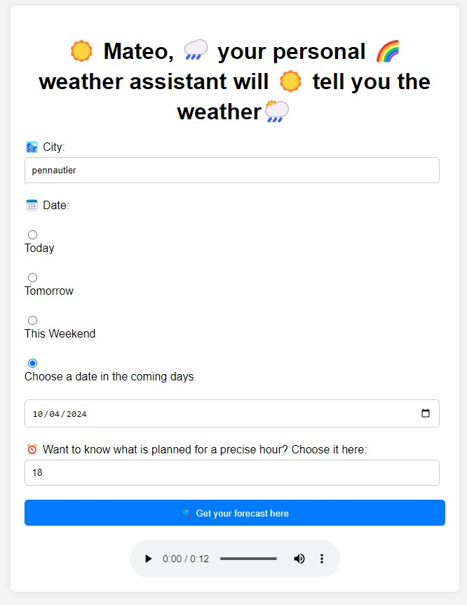

# MATEO YOUR PERSONAL WEATHER ASSISTANT

An IA will tell you what to wear tomorrow.
My first Azure integration.
normally all is accessible wordwild/

---

## Table of Contents

1. [Overview](#overview)
2. [How to Run](#how-to-run) -[Create the config.py](#create-config.py-file) -[Run deploy.sh](#change-and-run-deploy.sh-file)
3. [Different interesting points](#different-interesting-points)
4. [Notes](#notes)

---

b16mateo/
│
├── README.md
├── deploy.sh
│
├── 1conndb/ (connexion to postgress)
│ └── Dockerfile
│
├── 2load/ (will load datas from meteofrance and structure postgres db)
│ ├── .dockerignore
│ ├── batch_functions.py
│ ├── bacth.py
│ ├── cities_light.json (a json file with a sample of cities)
│ ├── config.py (to be created and integrated)
│ ├── connect.py
│ ├── Dockerfile
│ ├── load_forecast_api.py
│ ├── prog_bar.py
│ └── test_meteo_api.py
│
├── 3nlpapi/ (will generate text with meteofranceforecast and audio from text)
│ ├── audio
│ │ └── audio_montpellier_2024-04-10.mp3 (example)  
│ ├── config.py (to be created and integrated)
│ ├── connect.py
│ ├── Dockerfile
│ ├── nlpandlist.py
│ └── nlpapi.py
│
└── 4front/
├── js
│ └── script.js (change the azure domainname in line 47 and 92)
├── Dockerfile
├── index.html
└── styles.css

## Overview



## How to Run

### create config.py file

Make sure you have created a file "config.py" with data as such :

```
DBNAME='postgres'
USER='postgres'
PASSWORD='yourpassword'
HOST='localhost' #'localhost' when using Docker 'postgres' when using AZure b16connect1-5432.dzfcgng7htgybccp.westeurope.azurecontainer.io
PORT='5432'

MY_KEY = "YOUREDENAIKEY"

TABLE_NAME_FC= 'forecast_weather'
TABLE_NAME_CITY= 'cities'
```

This same file should be in both repositories=>
b16mateo/2load & b16mateo/3nlpapi

### Change and run deploy.sh file

1. Create your registry in Azure
   While you get Azure registry you can replace all data in the deploy.sh file such as : yourregisterazurename and your password generated
   docker login yourregisterazurename.azurecr.io -u yourregisterazure -p "yourpasswordazure"

2. Run the file : deploy.sh
   Then follow the instructions (with changing the PORT name when it is asked in config.py and in script.js and create the 4 corresponding container instances in Azure corresponding to each docker images.
   For each docker created and pulled create the corresponding instance in Azure and make them run.

- Azure instance b16connect will run w/o stopping
- Azure instance b16load will run and stop after downloading the 2 tables. If you want fresh forecasts you will have to run it again
- Azure instance b16nlpapi will run all the time => to check its health go to swagger b16nlpapiXdomainnameXazure.io:8002/docs
- Azure instance b16front will run all the time => to check its health go to b16frontXdomainnameXazure.io:3002

## Different interesting points

- Need to make sure your key is working in EDENAI
- Need to work a bit deeper on a dockercompose and a deploy.sh file easier to run

## Notes

Improvements :

- no connexion between NLP and db postgress
- username creation
- collect the audio file created in a db to be able to read them if the weather is asked for the same city same date and same hour and avoid multiple redundant demands
- improve webpage with a uppercase text for cities a stream instead of an audio player
- implement the automatic batch which update the forecast every 3 hours

```
## Usage

internal usage only. for training only
```

Contributing
Pull requests are welcome. For major changes, please open an issue first to discuss what you would like to change.
Please make sure to update tests as appropriate.
